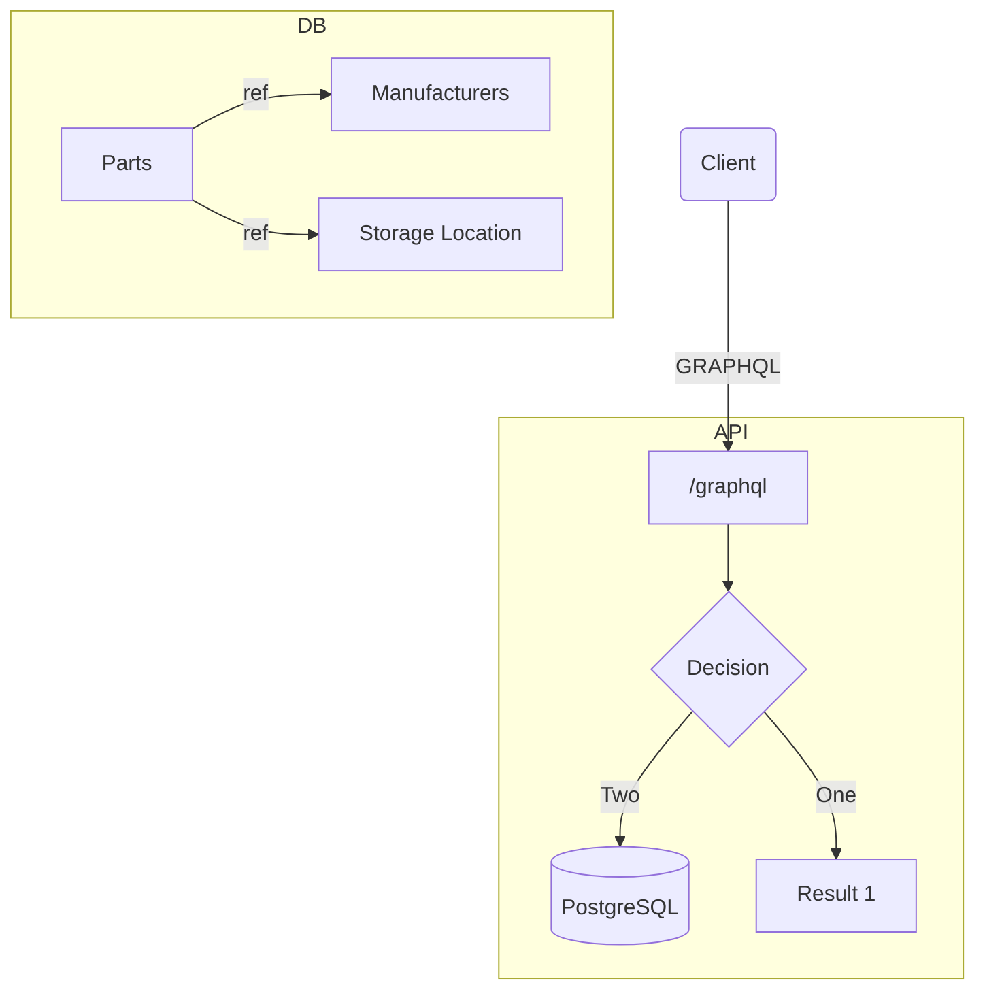

```mermaid
graph TD

client(Client) -->|GRAPHQL| api
db[(PostgreSQL)]

subgraph API
api["/graphql"]
api --> C{Decision}
C -->|One| D[Result 1]
C -->|Two| db
end

subgraph DB
parts[Parts]
manufacturers[Manufacturers]
storage_location[Storage Location]

parts --> |ref| manufacturers & storage_location
end
```